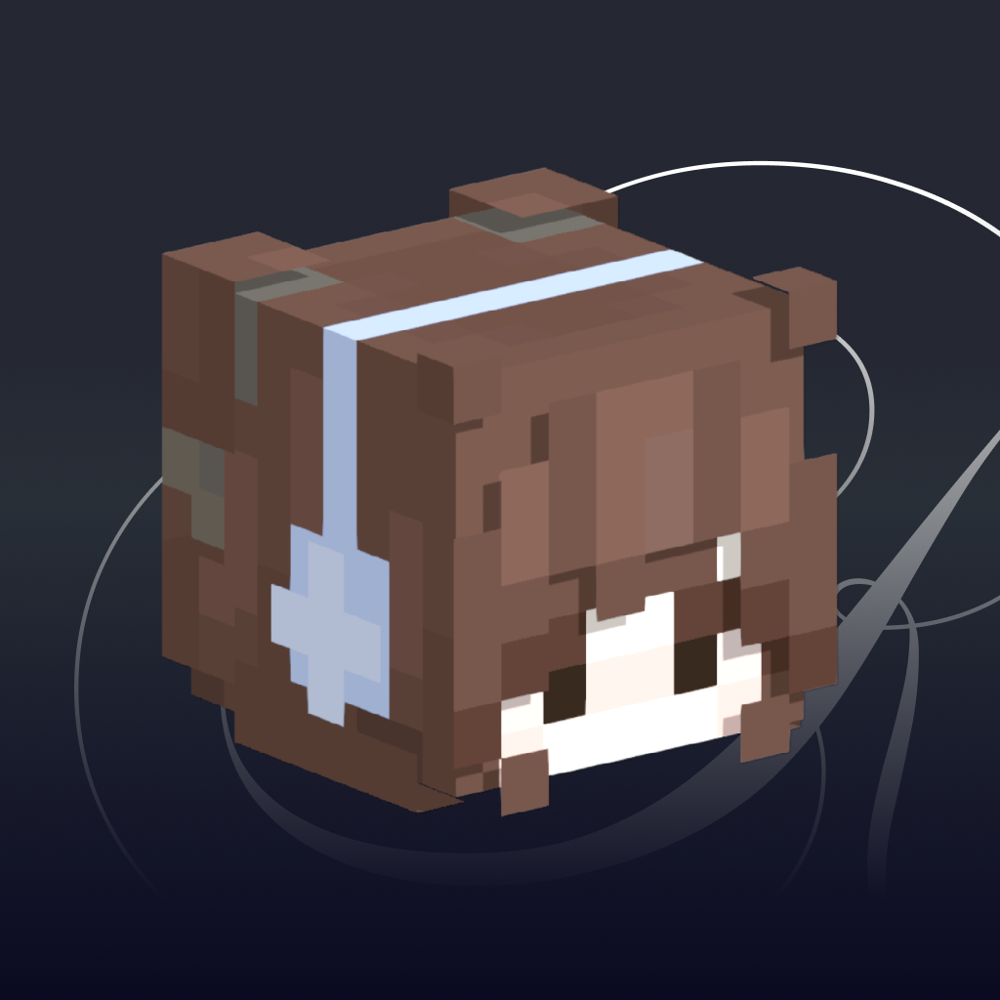

<h1 align="center">
  
  &nbsp;RYKSU
</h1>

<p align="center">
  <strong>Minecraft bot control, from your desktop.</strong>
</p>

<p align="center">
  Connect, monitor, and automate Minecraft bots through a desktop interface.<br />
  Built with Electron, React, and Mineflayer.
</p>

<p align="center">
  <a href="https://github.com/0xmthan/Ryksu/actions/workflows/ci.yml">
    
  </a>
  <a href="https://github.com/0xmthan/Ryksu/blob/main/package.json">
    
  </a>
</p>

<p align="center">
  <a href="https://github.com/0xmthan/Ryksu/issues">Report a bug</a>
  &nbsp;·&nbsp;
  <a href="https://github.com/0xmthan/Ryksu/issues/new">Request a feature</a>
</p>

## Development

Use Node.js 22.13 or newer and the pnpm version specified in `package.json`.
The current Minecraft data override requires the sibling
`../minecraft-data-26.2` checkout configured in `pnpm-workspace.yaml`;
the CI workflow documents the exact source revisions.

```sh
pnpm install --frozen-lockfile
pnpm dev
```

Electron Forge uses Vite to build the main process, preload script, and React
renderer. Runtime Node packages remain external and are included in the
packaged app so their native modules and Minecraft data remain available.

```sh
pnpm test
pnpm typecheck
pnpm make
```

Build output lives in `.vite/`, and distributables are written to `out/make/`.

See [CI and release details](.github/DEVELOPMENT.md) for reports, release builds,
and the temporary Minecraft data override.
